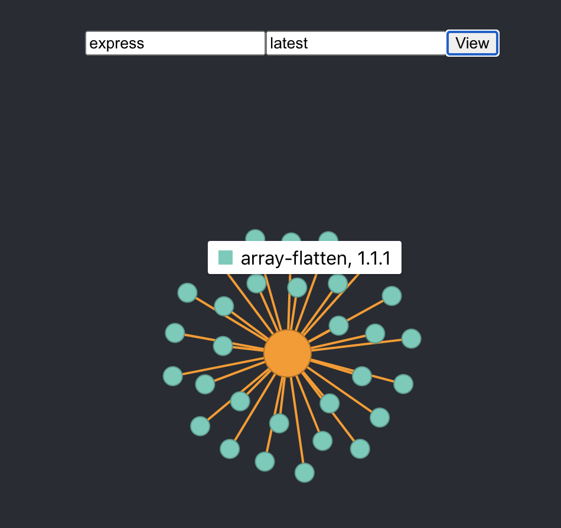
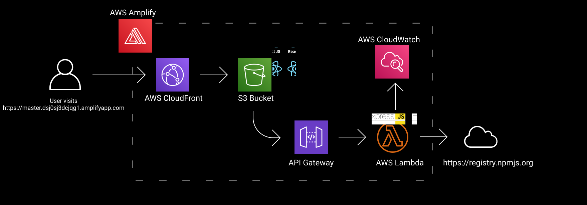

# NPM dependencies viewer



A web app to visualize the direct dependencies of any NPM package. Powered by **React**, **AWS Amplify**, **Express** and **Nivo**.

See it in action here: https://master.dsj0sj3dcjqg1.amplifyapp.com

## Architecture

With [AWS Amplify](https://aws.amazon.com/amplify/), it is easy to roll out the following stack, laying the foundations for topics like:

- Out-of-the-box monitoring with [AWS CloudWatch](https://aws.amazon.com/cloudwatch/)
- Scalability with AWS Lambda functions
- Standard API definition with [AWS API Gateway](https://aws.amazon.com/api-gateway/)



## Frontend

The frontend is composed of a _create-react-app application_. The main chart is made with the [Network chart](http://nivo.rocks/network) component from the great library [Nivo](http://nivo.rocks) to implement the visualization.

For details on usage, see section [Scripts provided by create-react-app](#scripts-provided-by-create-react-app).

## Backend

The backend is located in directory [amplify](./amplify). It uses [Axios](https://www.axios.com) to perfom REST API calls. An in-memory caching is done with [Lodash's memoize](https://lodash.com/docs/4.17.15#memoize) function by memoizing the calls to https://registry.npmjs.org, so that they are run a single time for a given package/version pair. Subsequent calls to the memoized function will look up into the cached results.

### Deploying the API

```
amplify push
```

### Adding a new API

```
amplify add api
```

For more details, read the [Amplify Docs](https://docs.amplify.aws/).

## Scripts provided by create-react-app

In the project directory, you can run:

### `npm start`

Runs the app in the development mode.\
Open [http://localhost:3000](http://localhost:3000) to view it in the browser.

The page will reload if you make edits.\
You will also see any lint errors in the console.

### `npm test`

Launches the test runner in the interactive watch mode.\
See the section about [running tests](https://facebook.github.io/create-react-app/docs/running-tests) for more information.

### `npm run build`

Builds the app for production to the `build` folder.\
It correctly bundles React in production mode and optimizes the build for the best performance.

The build is minified and the filenames include the hashes.\
Your app is ready to be deployed!

See the section about [deployment](https://facebook.github.io/create-react-app/docs/deployment) for more information.

### `npm run eject`

**Note: this is a one-way operation. Once you `eject`, you can’t go back!**

If you aren’t satisfied with the build tool and configuration choices, you can `eject` at any time. This command will remove the single build dependency from your project.

Instead, it will copy all the configuration files and the transitive dependencies (webpack, Babel, ESLint, etc) right into your project so you have full control over them. All of the commands except `eject` will still work, but they will point to the copied scripts so you can tweak them. At this point you’re on your own.

You don’t have to ever use `eject`. The curated feature set is suitable for small and middle deployments, and you shouldn’t feel obligated to use this feature. However we understand that this tool wouldn’t be useful if you couldn’t customize it when you are ready for it.

## Learn More

You can learn more in the [Create React App documentation](https://facebook.github.io/create-react-app/docs/getting-started).

To learn React, check out the [React documentation](https://reactjs.org/).

### Code Splitting

This section has moved here: [https://facebook.github.io/create-react-app/docs/code-splitting](https://facebook.github.io/create-react-app/docs/code-splitting)

### Analyzing the Bundle Size

This section has moved here: [https://facebook.github.io/create-react-app/docs/analyzing-the-bundle-size](https://facebook.github.io/create-react-app/docs/analyzing-the-bundle-size)

### Making a Progressive Web App

This section has moved here: [https://facebook.github.io/create-react-app/docs/making-a-progressive-web-app](https://facebook.github.io/create-react-app/docs/making-a-progressive-web-app)

### Advanced Configuration

This section has moved here: [https://facebook.github.io/create-react-app/docs/advanced-configuration](https://facebook.github.io/create-react-app/docs/advanced-configuration)

### Deployment

This section has moved here: [https://facebook.github.io/create-react-app/docs/deployment](https://facebook.github.io/create-react-app/docs/deployment)

### `npm run build` fails to minify

This section has moved here: [https://facebook.github.io/create-react-app/docs/troubleshooting#npm-run-build-fails-to-minify](https://facebook.github.io/create-react-app/docs/troubleshooting#npm-run-build-fails-to-minify)
